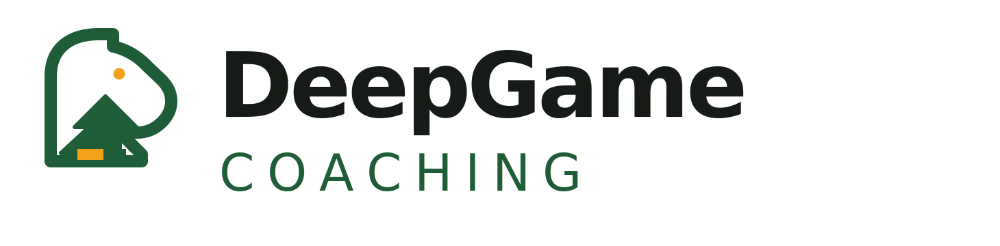
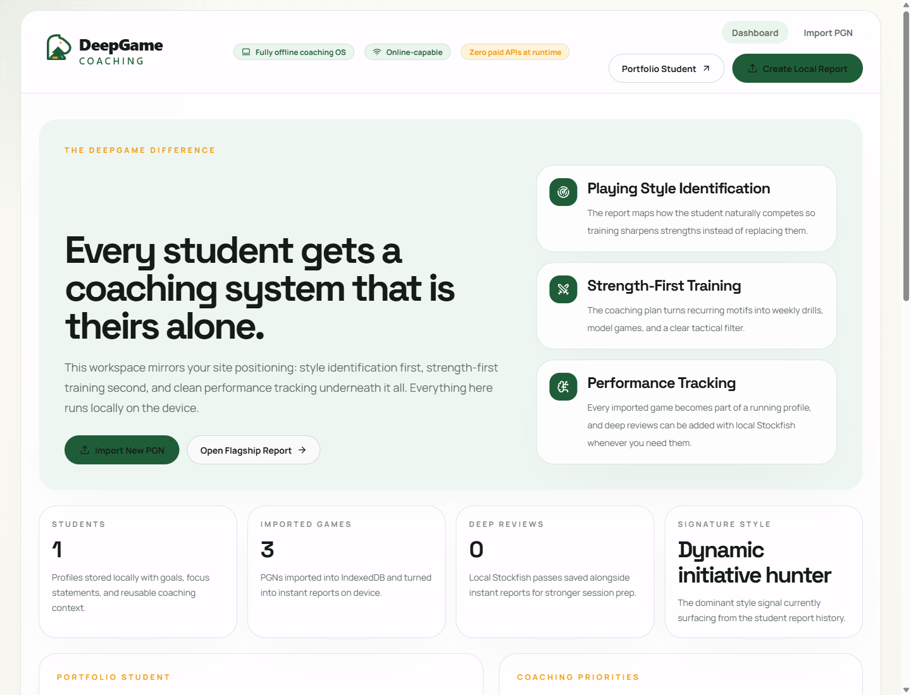

# DeepGame Coaching OS



Offline-first chess coaching workspace for turning a PGN into a coach-ready report, style fingerprint, training plan, and optional local Stockfish deep review.

This project was built to prove a simple point: useful AI-and-automation products do not need paid APIs to feel premium. DeepGame Coaching OS runs fully on-device with local parsing, local storage, local reporting, and local engine review.



## Why This Exists

Most chess tools stop at analysis. Most coaching tools stop at notes. This app connects the whole workflow:

- Import a PGN locally
- Diagnose the player's style
- Surface recurring strengths and leaks
- Build a training plan
- Prepare a lesson faster
- Keep everything private and offline-capable

For DeepGame Coaching, that means a product that matches the brand promise: coaching built around the student's real game, not a generic curriculum.

## Core Features

- Fully offline-first React PWA
- PGN intake with in-browser parsing and validation
- IndexedDB-backed student profiles, games, and saved analyses
- Instant heuristic coaching reports with style fingerprinting
- Optional local Stockfish deep review running in a web worker
- Session-ready outputs: strengths, leaks, training plan, agenda, critical moments, and follow-up
- Markdown export for reports
- DeepGame-branded coaching dashboard and review flows
- Zero paid APIs at runtime

## Portfolio Positioning

This is not just a chess app. It is a clean portfolio case study for:

- AI and automation systems thinking
- local-first product design
- offline-capable web app engineering
- lifecycle-style workflow design applied to coaching
- brand-aligned product execution for a real business

If you are presenting this project publicly, the strongest framing is:

> I built an offline-first coaching operating system that turns raw chess game files into structured coaching reports and training plans without relying on paid AI APIs.

## Stack

- React 19
- TypeScript
- Vite 8
- Tailwind CSS 4
- React Router 7
- Dexie + IndexedDB
- chess.js
- Stockfish WASM in a web worker

## Local Development

```bash
npm install
npm run dev
```

Open the app in a browser, then load a PGN or use the seeded demo profile.

## Verification

Project checks:

```bash
npm run lint
npm run build
```

What was explicitly verified during development:

- production build passes
- lint passes
- dashboard, intake, review, and student flows render correctly
- offline revisit works after assets are cached
- local PGN import works
- local Stockfish deep review works

## Deploy To Vercel

This app is static and does not require environment variables.

1. Push this folder to its own GitHub repository.
2. Import the repo into Vercel.
3. Use these settings:

```text
Framework preset: Vite
Build command: npm run build
Output directory: dist
Install command: npm install
```

4. Deploy.
5. Open the live site once while online so the service worker can cache the app shell and assets.
6. Test the offline flow on the deployed URL.

More detailed release notes live in [DEPLOY.md](./DEPLOY.md).

## Offline Model

The app is intentionally built so the important path stays local:

- PGNs are parsed in the browser
- student data is stored in IndexedDB
- reports are generated locally
- Stockfish runs locally in a worker
- the service worker caches the app shell and build assets

This keeps costs at zero and makes the app resilient if the network drops.

## Repo Map

- `src/routes` - main screens
- `src/lib/chess` - parsing, heuristics, report generation, and engine review
- `src/lib/db.ts` - local persistence and seeded data
- `src/lib/reportExport.ts` - markdown export
- `public/engines/stockfish` - local engine runtime
- `brand-assets/deepgame-logo-pack` - exported logo/icon pack for reuse

## Brand Assets

A reusable logo pack is included here:

- [brand-assets/deepgame-logo-pack](./brand-assets/deepgame-logo-pack)
- [brand-assets/deepgame-logo-pack.zip](./brand-assets/deepgame-logo-pack.zip)

## Current Constraints

- No backend
- No multi-device sync
- No live email sending
- No cloud persistence

Those are intentional for v1. The goal was a strong local product, not a SaaS bill.

## Next Up

Best next upgrades after launch:

- session recap generator
- printable lesson worksheet export
- richer opening-trend summaries across many imported games
- optional cloud sync behind a separate branch when budget allows
